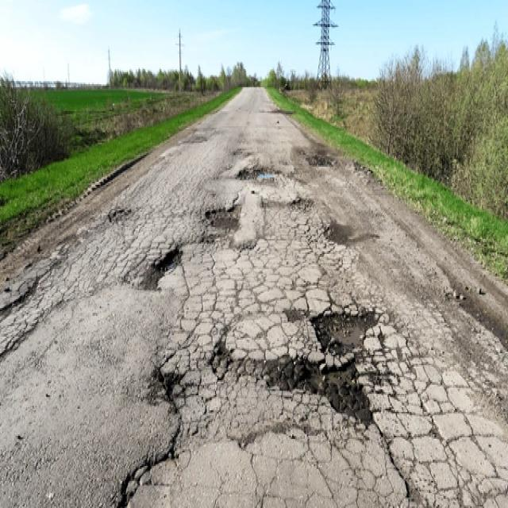
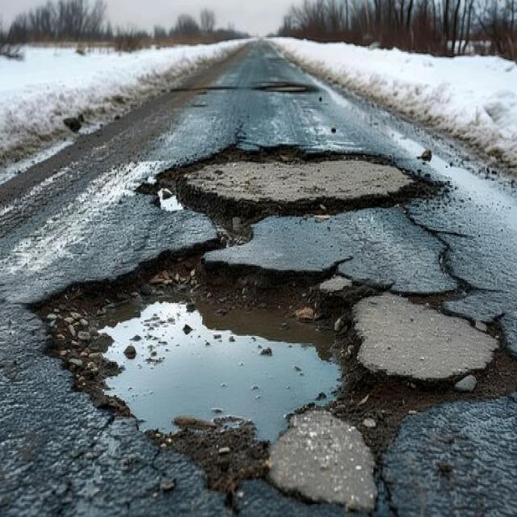
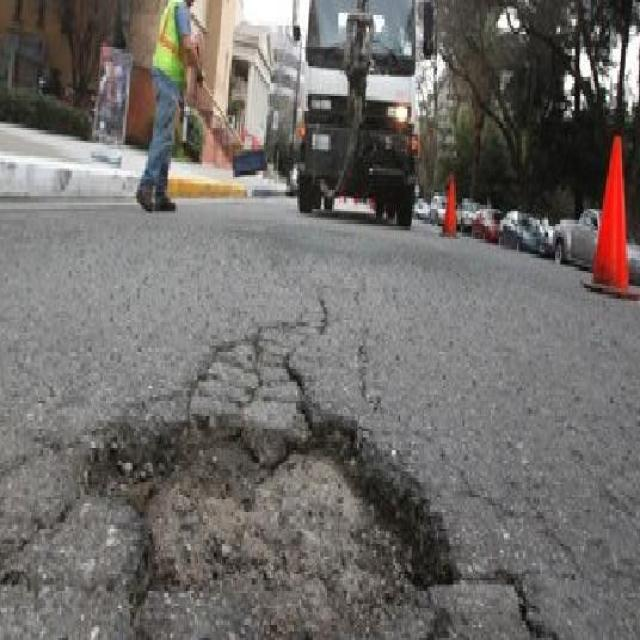

# A comparison of semantics segmentation approaches for pothole detection.
### Potholes Problems Overview
A pothole is a depression or cavity in the road surface that gradually develops as a result of water infiltration, repeated traffic load, and adverse weather conditions, leading to deterioration of the pavement. Potholes pose a significant threat to road safety, as they can damage vehicles, compromise driving comfort, and increase the risk of accidents by causing abrupt maneuvers or endangering cyclists and pedestrians.  

<!--  -->

  
  
  

  Some samples about potholes.

So we provides a thorough comparison of various semantic segmentation techniques applied to pothole detection on road surfaces. The models evaluated encompass traditional CNN-based architectures, including U-Net, FPN, and DeepLabv3, as well as advanced Transformer-based approaches such as SegFormer, Swin-Unet, and Mask2Former.  

You can see the full version of reference through [paper](https://easychair.org/conferences2/submission_download?a=34672663&submission=7282567&upload=151756).  
### How segmantic segmentation deals with those problems
Timely identification and repair of potholes are crucial for preserving road infrastructure, maintaining smooth traffic flow, and minimizing vehicle damage.  
Recent advancements in deep learning have brought semantic segmentation to the forefront of computer vision, with widespread applications in detecting everyday objects such as vehicles and animals.  
While deep learning-based semantic segmentation has shown remarkable progress in various road imagery tasks (Patel, Dabhi & Adhvaryu, 2024), its targeted application for pothole detection remains relatively limited and underexplored.  
In our experiments, all evaluated methods were trained and tested on two distinct datasets: the Potholes-Detection Dataset (PotholesDetection, 2024), which includes over 1,000 images of potholes, and the Pothole Mix Dataset (Ranieri, Moscoso Thompson & Biasotti, 2022), containing more than 4,000 images with varying resolutions.  
Two datasets are published, you can dowload through [Potholes-Detection](https://universe.roboflow.com/potholesdetection-aq76f/potholes-detection-ohg1g) (Roboflow) and [Pothole Mix Dataset](https://data.mendeley.com/datasets/kfth5g2xk3/2) (Ranieri, Moscoso Thompson & Biasotti, 2022). 
### Experimental Results
Deep Learning-Based Semantic Segmentation models can be classified into two main types: CNN-based methods (Unet, FPN, PSPNet, DeeplabV3 and DeeplabV3+) and Transformer-based models (Segformer, Mask2Former, Upernet and SwinUnet)  
To obtain the results of all models on both datasets, we utilized Kaggle as the computing platform.  

Notebooks use Pothole-Detection dataset:

